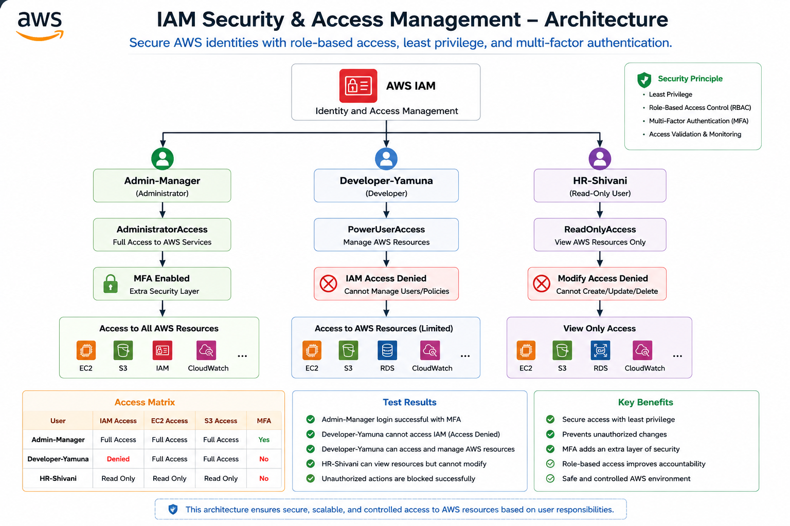

# IAM Security & Access Management

> Secure AWS identities with role-based access, least privilege, and multi-factor authentication.

---

## Why?

AWS cloud environments contain important resources and services that should not be accessible to every user.

This project demonstrates how AWS Identity and Access Management (IAM) can be used to control access based on user responsibilities.

The main goal is to provide the right level of access to each user while preventing unauthorized actions.

---

## What?

This project implements a practical AWS IAM security environment with three users representing different responsibilities.

| User                 | Role          | Policy              | Access Level                                   |
| -------------------- | ------------- | ------------------- | ---------------------------------------------- |
| **Admin-Manager**    | Administrator | AdministratorAccess | Full AWS access + MFA                          |
| **Developer-Yamuna** | Developer     | PowerUserAccess     | AWS resource management, no IAM administration |
| **HR-Shivani**       | HR            | ReadOnlyAccess      | Read-only access                               |

### Main Security Controls

* IAM user management
* Role-based access control
* Least privilege access
* Multi-factor authentication
* Controlled AWS resource access
* IAM administration restrictions
* Permission validation through actual login testing

---

## How?

The project was implemented using the AWS Management Console.

### Step 1 — Create IAM Users

Three IAM users were created:

* Admin-Manager
* Developer-Yamuna
* HR-Shivani

### Step 2 — Assign Policies

Different AWS managed policies were assigned based on user responsibilities.

**Admin-Manager**

* AdministratorAccess

**Developer-Yamuna**

* PowerUserAccess

**HR-Shivani**

* ReadOnlyAccess

### Step 3 — Enable MFA

A virtual MFA device was enabled for the Admin-Manager account using an authenticator application.

This provides an additional authentication layer for the privileged administrator account.

### Step 4 — Test User Access

Each user was logged into the AWS Management Console separately.

The permissions were tested to verify that users could only perform actions allowed by their assigned policies.

### Step 5 — Validate Security

The following access controls were validated:

* Administrator access with MFA
* Developer restriction from IAM administration
* Developer access to AWS resources
* HR read-only access
* Prevention of unauthorized modifications

---

## Architecture



The architecture shows how AWS IAM controls authentication and authorization for different users based on their assigned policies.

---

## Access Matrix

| User                 | IAM Access | EC2 Access | S3 Access | MFA          |
| -------------------- | ---------- | ---------- | --------- | ------------ |
| **Admin-Manager**    | Full       | Full       | Full      | Enabled      |
| **Developer-Yamuna** | Denied     | Allowed    | Allowed   | Not Required |
| **HR-Shivani**       | Read Only  | Read Only  | Read Only | Not Required |

This access model follows the **Principle of Least Privilege**, where users receive only the permissions required for their responsibilities.

---

## Permission Validation

### Admin-Manager

**Role:** Administrator

**Policy:** AdministratorAccess

**Result:** Successful login with MFA.

The administrator has full access to AWS services and IAM management capabilities.

### Developer-Yamuna

**Role:** Developer

**Policy:** PowerUserAccess

The developer can manage AWS resources but cannot administer IAM users and permissions.

**IAM Test Result:** Access Denied


This demonstrates separation of administrative responsibilities from development activities.

### HR-Shivani

**Role:** HR

**Policy:** ReadOnlyAccess

The HR user is provided with read-only access to AWS resources and cannot perform modification operations.

**Modification Test Result:** Access Denied


This demonstrates the Principle of Least Privilege.

---

## Security Controls

### 1. Least Privilege

Each user receives access according to their job responsibility.

### 2. Role-Based Access Control

Different policies are assigned to users based on their roles.

### 3. Multi-Factor Authentication

MFA is enabled for the administrator to provide an additional layer of security.

### 4. Separation of Duties

The developer and HR users cannot perform administrator-level IAM operations.

### 5. Permission Validation

Actual login and access tests were performed to verify that the configured policies work as expected.

---

## Test Results

| Test                          | Expected Result               | Status |
| ----------------------------- | ----------------------------- | ------ |
| Admin login                   | Successful                    | Passed |
| Admin MFA                     | MFA authentication successful | Passed |
| Developer IAM access          | Access Denied                 | Passed |
| Developer AWS resource access | Allowed                       | Passed |
| HR read-only access           | Allowed                       | Passed |
| HR unauthorized modification  | Access Denied                 | Passed |

---

## Project Evidence

The repository contains AWS Console screenshots demonstrating the implementation and validation of the security controls.

The complete AWS Console evidence is available in the `screenshots` folder, including:

* IAM user creation
* User list
* Administrator MFA configuration
* Administrator login
* Developer IAM restriction
* Developer resource access
* HR login
* HR access restriction

---

## Project Structure

```text
IAM-Security-Management/
│
├── README.md
├── Architecture.png
│
└── screenshots/
    ├── admin-created.png
    ├── admin-login.png
    ├── admin-MFA.png
    ├── developer-denied.png
    ├── he-ec2-denied.png
    ├── hr-login.png
    ├── hr-user-denied.png
    └── users-list.png
```

---

## Technologies & Services

* AWS IAM
* AWS EC2
* AWS S3
* AWS Management Console
* AWS Managed Policies
* Multi-Factor Authentication

---

## Key Benefits

* Protects AWS resources from unauthorized access
* Reduces unnecessary permissions
* Prevents unauthorized IAM administration
* Provides additional security through MFA
* Demonstrates practical cloud security concepts
* Improves accountability through role-based access
* Supports the Principle of Least Privilege

---

## Learning Outcomes

Through this project, I gained practical experience in:

* AWS IAM user management
* Identity and access management
* AWS managed policies
* Role-based access control
* Least privilege implementation
* MFA configuration
* Permission testing
* Cloud security best practices

---

## Future Enhancements

* Create IAM groups for different departments
* Implement custom customer-managed policies
* Configure AWS CloudTrail for access auditing
* Implement IAM Access Analyzer
* Add automated security monitoring
* Implement credential rotation policies
* Add centralized security logging

---

## Conclusion

This project demonstrates a practical AWS IAM security model where access is controlled according to user responsibilities.

By combining role-based access control, least privilege, MFA, and permission validation, the project provides a structured approach to securing identities and AWS resources.

The implementation also demonstrates how different users can safely work within the same AWS environment without receiving unnecessary administrative privileges.
